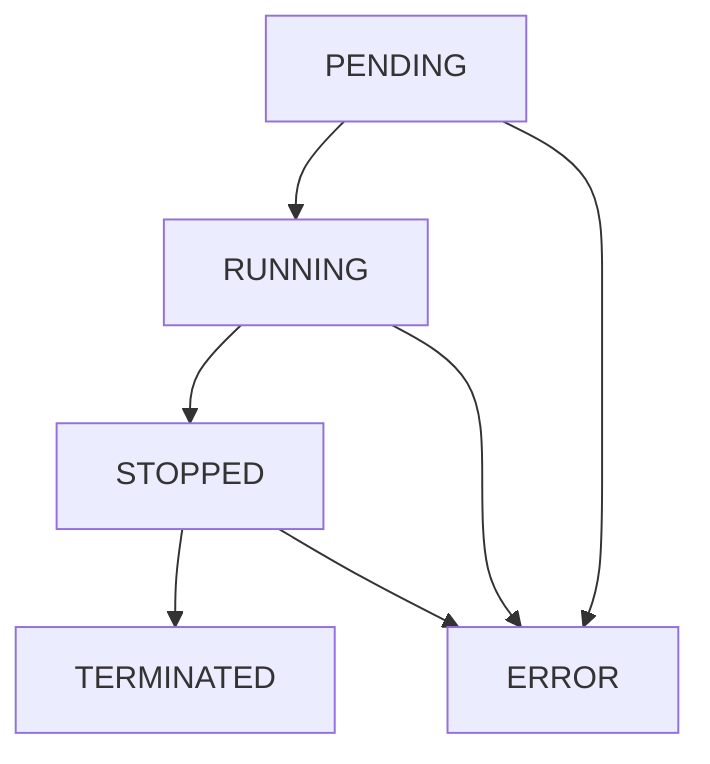
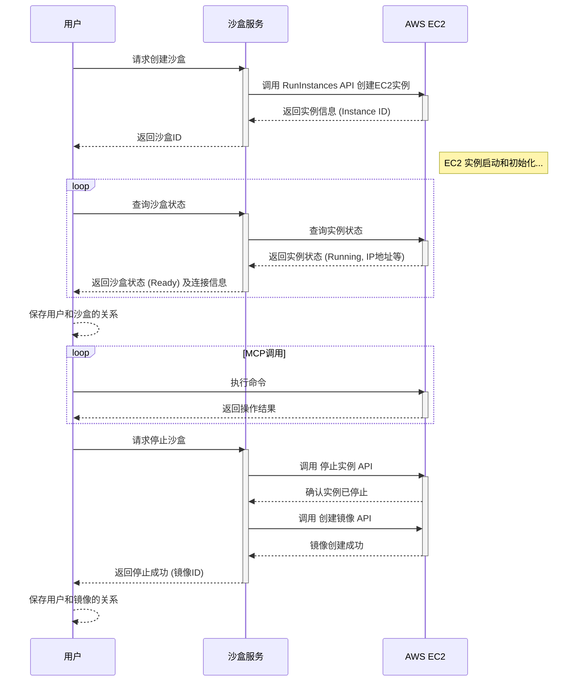
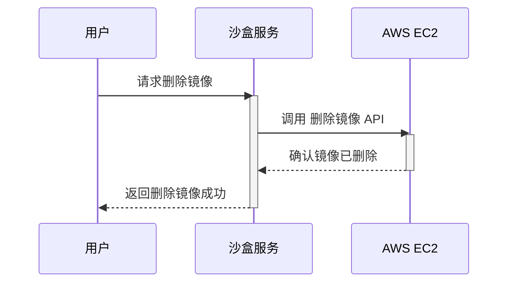

# 核心概念

## 沙盒实例

沙盒实例是系统中的核心资源，它是一个基于AWS EC2的虚拟机实例，提供独立的计算环境。

### 生命周期

沙盒实例有以下几种状态：

1. **PENDING**：沙盒正在创建中，包括EC2实例启动和初始化配置阶段
2. **RUNNING**：沙盒正常运行中，可以访问
3. **STOPPED/TERMINATED**：沙盒已终止/删除
4. **ERROR**: 实例异常

生命周期转换图：

### 沙盒操作时序

### 自定义CPU和内存

沙盒实例支持自定义CPU和内存配置：

- **CPU**：可选择不同核心数量
- **内存**：可选择不同内存大小

通过`instanceSpecification`参数指定，格式为`{CPU核心数}u{内存GB数}g
- `1u1g`(默认)：1核心1GB内存 
- `2u4g`：2核心4GB内存
 

### 持久化

沙盒实例使用以下存储方式：

- **快照**：在创建镜像时生成，用于保存实例状态

## 镜像

镜像是创建沙盒实例的蓝图，包含操作系统和预安装的软件。用户停止沙盒时自动生成该沙盒的镜像

### 镜像操作时序
