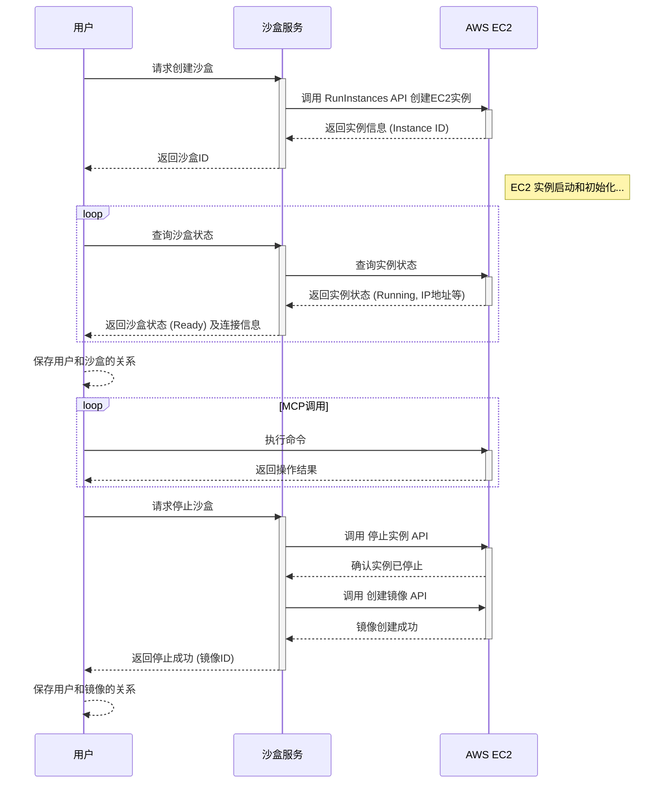
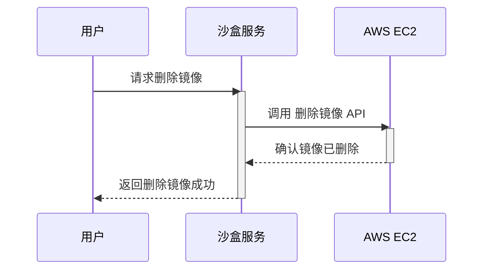

# 时序图

本文档包含沙盒实例和镜像的生命周期时序图，用于说明系统交互流程。

## 沙盒

```mermaid
sequenceDiagram
    participant 用户
    participant 沙盒服务
    participant AWS EC2

    用户->>沙盒服务: 请求创建沙盒
    activate 沙盒服务
    沙盒服务->>AWS EC2: 调用 RunInstances API 创建EC2实例
    activate AWS EC2
    AWS EC2-->>沙盒服务: 返回实例信息 (Instance ID)
    deactivate AWS EC2
    沙盒服务-->>用户: 返回沙盒ID
    deactivate 沙盒服务

    Note right of AWS EC2: EC2 实例启动和初始化...

    loop
        用户->>沙盒服务: 查询沙盒状态
        activate 沙盒服务
        沙盒服务->>AWS EC2: 查询实例状态
        activate AWS EC2
        AWS EC2-->>沙盒服务: 返回实例状态 (Running, IP地址等)
        deactivate AWS EC2
        沙盒服务-->>用户: 返回沙盒状态 (Ready) 及连接信息
        deactivate 沙盒服务
    end
    用户-->> 用户: 保存用户和沙盒的关系


    loop MCP调用
        用户->>AWS EC2: 执行命令
        activate AWS EC2

        AWS EC2-->>用户: 返回操作结果
        deactivate AWS EC2
    end


    用户->>沙盒服务: 请求停止沙盒
    activate 沙盒服务
    沙盒服务->>AWS EC2: 调用 停止实例 API
    activate AWS EC2
    AWS EC2-->>沙盒服务: 确认实例已停止
    沙盒服务->>AWS EC2: 调用 创建镜像 API
    AWS EC2-->>沙盒服务: 镜像创建成功
    deactivate AWS EC2
    沙盒服务-->>用户: 返回停止成功 (镜像ID)
    deactivate 沙盒服务
    用户-->> 用户: 保存用户和镜像的关系
```

## 镜像

```mermaid
sequenceDiagram
    participant 用户
    participant 沙盒服务
    participant AWS EC2
    用户->>沙盒服务: 请求删除镜像
    activate 沙盒服务
    沙盒服务->>AWS EC2: 调用 删除镜像 API
    activate AWS EC2
    AWS EC2-->>沙盒服务: 确认镜像已删除
    deactivate AWS EC2
    沙盒服务-->>用户: 返回删除镜像成功
    deactivate 沙盒服务
``` 